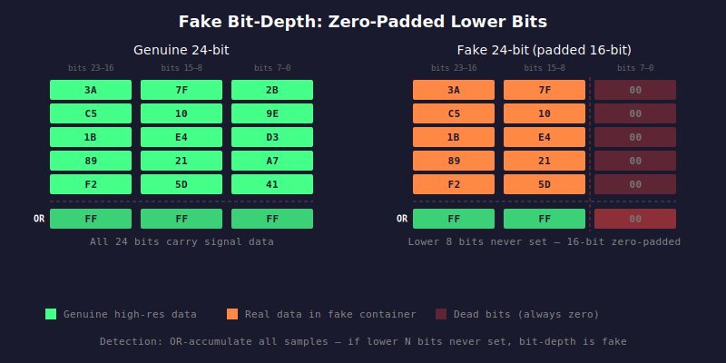

# HAU-002: fake-bit-depth

## What it does

Nothing on the sound itself. It just sounds as good or bad as if it was on a CD.

However, it does piss you off.
You probably paid top dollar for a so-called hi-res file, but what you got is very much CD.

## What it is

Fraud.

You have a file that says "hi-res" 24 bit, but actually there is nothing past 16 bits.

## What caused it

> The music industry, marketing, and gullible people

Bigger, better. Buy the latest format.

But for it to make any sense, it would require that:
- the record company actually has high resolution material and they use that to generate the new files instead of just
padding the old CD master with... zeros (hint: they might not have that material)
- you could hear the difference (hint: you cannot)

> The person who did the rip

Maybe they felt cute, and decided to rip a CD then use a higher resolution when encoding?

## Recoverability

There is nothing to recover, because there is no sound loss.

What you can (and should) recover is your money, from whoever you acquired this from.

## How we detect it

We OR-accumulate every sample value across the entire file and check whether the lower bits
are ever set. For a 24-bit file, if the lower 8 bits are always zero across all samples, it is
really 16-bit data zero-padded to 24 bits. For 32-bit files, we check both 16-to-32 and 24-to-32
padding. An early exit triggers as soon as genuine lower-bit activity is detected, so files
with real high-resolution content are identified quickly.

## False positives

No.

## Severity

Yes / no.

It claims to be N bits. Does it have bits there or not?
If it does not, then it is lying: a 24-bit file with only 16 bits of actual data is just 16-bit zero-padded.
