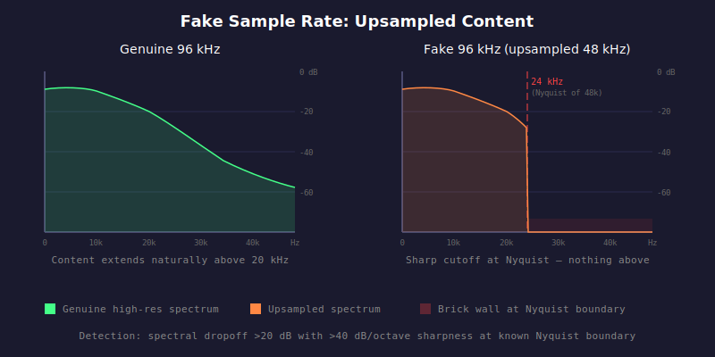

# HAU-003: fake-sample-rate

## What it does

Nothing on the sound itself. It just sounds as good or bad as the same thing on a CD.

## What it is

Fraud.

You have a file that says "hi-res" 96kHz, but there is nothing above, say, 22050 Hz.

## What caused it

> The music industry, marketing and gullible people

Unscrupulous record company / streaming platform / person, punking you out of some extra dollar
for something that does not exist and that you could not hear if it did.

> The person who did the rip

Same as above. Upsampled the file to make it look better.

## Recoverability

Nothing to recover.

## How we detect it

We look for a spectral brick wall at the Nyquist frequency of a lower sample rate.
For example, a 96 kHz file that was upsampled from 48 kHz will show a sharp energy dropoff
at 24000 Hz. We check all standard Nyquist boundaries (22050, 24000, 44100, 48000 Hz)
against the file's claimed rate. A dropoff exceeding 20 dB with sharpness above 40 dB/octave
at a known boundary is flagged as upsampling.

## False positives

None.

## Severity

Similar to fake bit-depth, but a bit more subtle.
If there is no signal up there, then it has been upsampled, and you got punked for sure.
However, the opposite is not quite true: just because there is some signal up there does not positively mean that it has not been upsampled.

For high sample rates (88200, 96000, etc.), we conservatively report 50% confidence
when no upsampling is detected, which means: "we found no conclusive evidence that this was upsampled,
but we can't be positive that it wasn't".

For base sample rates (44100, 48000), there is no standard lower rate to upsample from,
so the check is not applicable, and we report 100% confidence.
