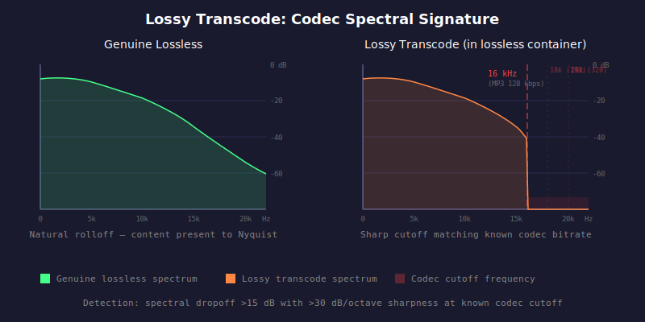

# HAU-004: lossy-transcode

## What it does

You think you have a lossless file, and what you hear is all the artifacts of a lossy file (distortion, cut-off
frequencies).

## What it is

Possibly fraud.

Your file was encoded lossily somewhere in the chain, before being re-encoded losslessly (but see below).

## What caused it

> Record company fraud

The label or distributor worked from a lossy source.
Budget reissue labels sometimes master from whatever digital source they can
obtain, which may already be lossy. The resulting CD or "lossless" download
carries the lossy spectral signature baked in from the source.

> The person who did the rip

Whoever was between you and the CD may have decided to re-encode a lossy file as lossless (to make it look better?).

> ... however...

Aggressive mastering, where the engineer applied a steep low-pass filter near 20 kHz, producing a brick wall that
is indistinguishable from a lossy codec cutoff. This is rare but not impossible.

## Recoverability

Get the original media and check it.

## How we detect it

We look for a spectral brick wall: a sharp energy dropoff at a frequency
consistent with a known lossy codec and bitrate. Known cutoff frequencies are checked:
15.5 kHz (AAC 128), 16 kHz (MP3 128), 17.5 kHz (MP3 160), 18 kHz (MP3/AAC 192),
19 kHz (MP3/AAC 256), 20 kHz (MP3 320), and 20.5 kHz (Opus 128).
A dropoff exceeding 15 dB with sharpness above 30 dB/octave is flagged, and the
most likely codec/bitrate match is reported.

## False positives

If the master itself has a hard cutoff that matches the signature of lossy encoders, we will wrongly identify it
as "fake-lossless". This is common for older jazz records that have not been properly remastered / enhanced (CD reissues
from the 80s/90s), where there is literally nothing above 20.5kHz.

## Severity

A positive detection means "there is a brick wall in the spectrum consistent with
lossy encoding." It does **not** tell you who in the chain introduced it.

The tool cannot distinguish between the different cases. It reports the spectral evidence
and lets you decide.
Context matters then: a 2016 budget reissue of 1960 recordings could be any of the above,
while a brand-new release from a major label with a 16 kHz cutoff is almost certainly a lossy transcode.
