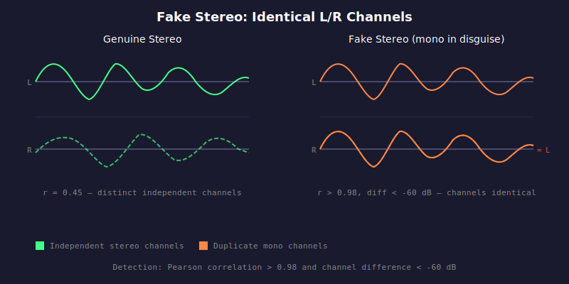

# HAU-005: fake-stereo

## What it does

Deceptive.
Wasted storage.

## What it is

Identical L/R channels marketed as stereo.

## What caused it

> Record company

Lazy / dishonest. A mono recording dressed up as stereo.

> The person who did the rip

Possibly duplicated a mono channel into both L/R during encoding.

## Recoverability

Not really. Not worth addressing.

## How we detect it

We compute Pearson correlation between left and right channels and the RMS level
of their difference. Binary detection: correlation > 0.98 and channel difference < -60 dB.

## False positives

No.

## Severity

If both channels are virtually identical, this is a mono recording dressed up as stereo.
Not a defect per se, but dishonest if sold as stereo content.
Always reported as moderate severity when detected.
