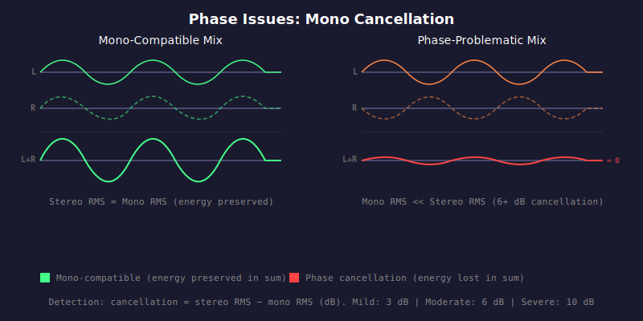

# HAU-006: phase-issues

## What it does

Sounds hollow on mono systems (phone speakers, some Bluetooth, club PAs summed to mono), disappearing instruments.

## What it is

L/R cancellation when summed to mono.

## What caused it

> Record company

Bad sound engineering. Excessive out-of-phase content in the stereo mix, or
accidental polarity inversion of individual tracks during mixing.

## Recoverability

No.

## How we detect it

We compute the RMS of the mono sum (L+R)/2 and the stereo RMS sqrt((L^2+R^2)/2),
then measure cancellation as the difference in dB between stereo RMS and mono RMS.
A large positive difference means significant energy is being lost when the stereo
signal is summed to mono, indicating out-of-phase content.

## False positives

No.

## Severity

A well-mixed stereo track should be mono-compatible with minimal cancellation.

- Mild: 3 dB cancellation
- Moderate: 6 dB cancellation
- Severe: 10 dB cancellation
