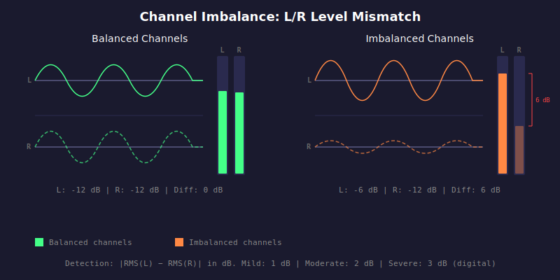

# HAU-008: channel-imbalance

## What it does

Hard to stomach with headsets.
Unbalanced music.

## What it is

The absolute dB difference between left and right channel levels.
A well-mastered stereo track should have reasonably balanced channels.

## What caused it

> Record company

Bad mastering, equipment issues, bad transfer.

## Recoverability

No.

## How we detect it

We compute RMS levels for left and right channels independently
and report the absolute difference in dB.

## False positives

Slight imbalance can be intentional (artistic panning).

Mono-era recordings pressed with early stereo techniques may present
significant channel imbalance, sometimes intentionally (hard panning as a norm).

## Severity

For digital and live sources:
- Mild: 1 dB
- Moderate: 2 dB
- Severe: 3 dB

For vinyl, thresholds are wider to account for the analog path and era-specific
mastering practices (e.g. hard panning on early stereo pressings):
- Mild: 3 dB
- Moderate: 6 dB
- Severe: 10 dB
