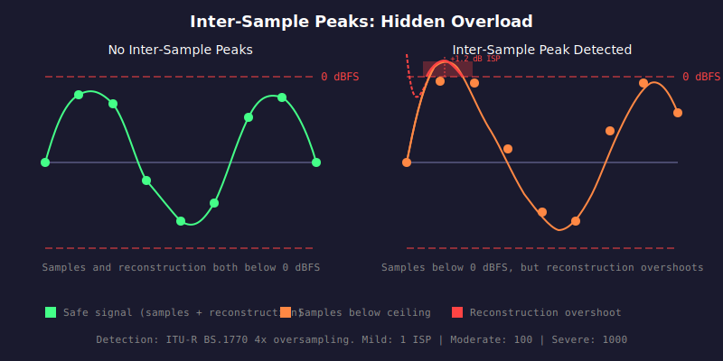

# HAU-009: inter-sample-peaks

## What it does

Causes clipping (see HAU-001), but invisible to naive peak meters.

This is a concern for two reasons:
- any DAC that does not do attenuation before reconstruction will clip
- lossy encoding with ISPs will generate audible distortions

## What it is

When a DAC reconstructs the analog signal between samples,
the interpolated waveform can exceed 0 dBFS even if no individual sample clipped.

## What caused it

> Record company

Mastering too hot without true-peak limiting. The mastering engineer used a sample-peak
limiter that kept individual samples below 0 dBFS, but the reconstructed analog waveform
overshoots between samples.

## Recoverability

No.
You can buy a better DAC though.

## How we detect it

True peak analysis per ITU-R BS.1770: 4x polyphase oversampling using a windowed sinc
filter with Kaiser window (beta=5). Each input sample is interpolated to 4 intermediate
points. Any interpolated sample exceeding 0 dBFS (absolute value > 1.0) is counted as
an ISP event, and the maximum overshoot in dB is tracked.

## False positives

No.

## Severity

Severity is based on the number of ISP events:
- Mild: 1
- Moderate: 100
- Severe: 1000
