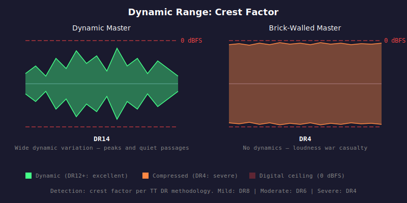

# HAU-010: dynamic-range

## What it does

A "loud" master (brick-walled) sounds like it is all at the same volume during the entire track.

A dynamic master has wide volume variation and a lot more subtlety and ability
to climax and impact.

## What it is

A metric based on crest factor / DR score, that identifies "loud" vs "dynamic" masters.

## What caused it

> The music industry

For many years, they engaged in the loudness war (the louder, the better),
effectively destroying many good records and remasters in the process.

## Recoverability

No.

## How we detect it

DR score, roughly equivalent to the crest factor measured per the
TT Dynamic Range methodology. The audio is split into 3-second blocks.
For each block, peak amplitude and RMS are measured. The second-highest peak
(to avoid outliers) is compared against the average of the top 20% of RMS values.
The ratio in dB gives the dynamic range score. Higher is more dynamic.

## False positives

No.

## Severity

The scale is descending: lower scores are worse.

- DR12+: Excellent dynamics
- DR8-11: Good dynamics
- Mild: DR8 (compressed but acceptable)
- Moderate: DR6 (heavily compressed)
- Severe: DR4 (brick-walled, loudness war casualty)
