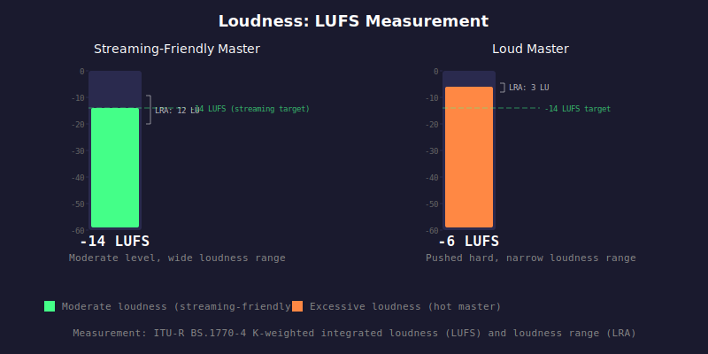

# HAU-011: loudness

## What it does

This is mostly informational, and matters for context.
A loud master will clip or have ISPs more easily.

## What it is

How loud it is, measured in LUFS (Loudness Units relative to Full Scale).

## What caused it

> Record company

Mastering decisions. Louder masters are common in the loudness war era.

## Recoverability

Not applicable. This is an informational measurement, not a defect.

## How we detect it

ITU-R BS.1770-4 K-weighted integrated loudness measurement. The signal is passed through
a two-stage K-weighting filter (high shelf pre-filter modeling head acoustics, plus
RLB high-pass weighting). Power is measured in 400 ms momentary windows with 100 ms hop.
Integrated loudness uses dual-gating: an absolute gate at -70 LUFS removes silence,
then a relative gate at -10 LU below the ungated mean removes quiet passages.
Loudness range (LRA) is the difference between the 95th and 10th percentiles of
gated short-term (3 s) loudness measurements.

## False positives

Not applicable. This is an objective measurement.

## Severity

This is primarily informational. No severity thresholds are applied.
