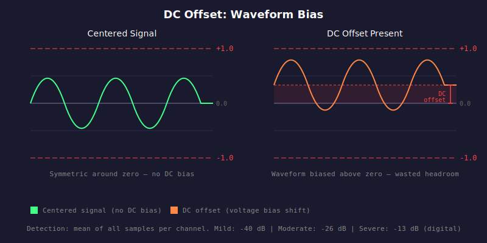

# HAU-012: dc-offset

## What it does

No big audible impact.
Wasted headroom.
Clicks between tracks.
Speaker stress.

## What it is

A constant voltage bias that shifts the waveform away from zero.

## What caused it

> Record company

Usually caused by faulty hardware (sound card, ADC) or a bad analog chain.

## Recoverability

Very unlikely.
This is a recording defect.
It is also a minor issue that is unlikely to have perceivable impact on you.

## How we detect it

We compute the mean of all samples per channel across the entire track.
The absolute average across channels gives the DC offset, expressed in dB.
Per-channel offsets are also reported.

## False positives

No.

## Severity

Measured in dB (higher = worse). Vinyl rips and live recordings tolerate more
because of the analog path involved.

- Mild: -40 dB (digital), -26 dB (vinyl), -30 dB (live)
- Moderate: -26 dB (digital), -13 dB (vinyl), -20 dB (live)
- Severe: -13 dB (digital), 0 dB (vinyl), -10 dB (live)
