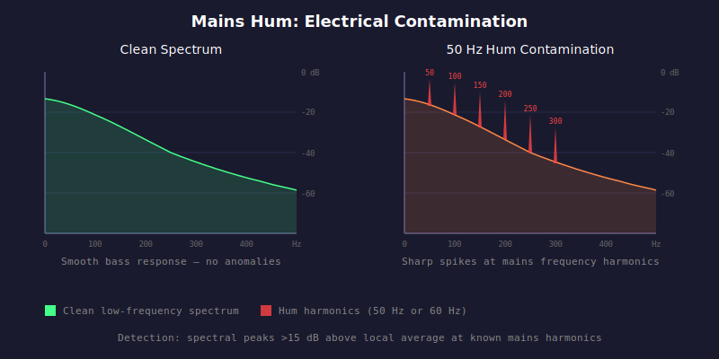

# HAU-013: hum

## What it does

Constant "hum sound" in the background (50 Hz Europe/Asia, 60 Hz Americas/Japan).

## What it is

Mains frequency electrical contamination.

## What caused it

> Record company

This is caused by electromagnetic interference from power lines bleeding into the audio chain.
Typical of poor recording/transfer, ground loop...

> Person who ripped the vinyl

Yes, turntables may introduce significant hum if they are bad.

## Recoverability

No.

## How we detect it

We check for sharp spectral spikes at the harmonics of 50 Hz (100, 150, 200, 250, 300 Hz)
and 60 Hz (120, 180, 240, 300, 360 Hz). Each harmonic's peak bin is compared against
surrounding bins (plus/minus 5, excluding plus/minus 1). A peak sharpness check requires the peak to stand
at least 6 dB above its immediate neighbors (plus/minus 1 bin) to distinguish genuine tonal spikes
from broad bass content (synth, kick drum). If any sharp spike exceeds 15 dB above the
local average, hum is flagged.

## False positives

No.

## Severity

Vinyl rips almost always have some hum from the turntable motor and grounding.
Live recordings pick up hum from PA systems and stage lighting.

- Mild: 10 dB (digital), 20 dB (vinyl), 15 dB (live)
- Moderate: 20 dB (digital), 30 dB (vinyl), 25 dB (live)
- Severe: 30 dB (digital), 40 dB (vinyl), 35 dB (live)
