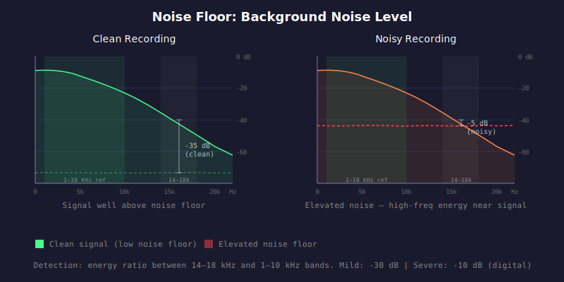

# HAU-014: noise-floor

## What it does

Constant hiss/noise in addition to the music.

## What it is

The overall background noise level of the recording in dB.
Lower (more negative) is cleaner.

## What caused it

> Record company

Poor source quality, bad transfer.

## Recoverability

No.

## How we detect it

We measure the average energy in the 14-18 kHz band (high frequency) and compare it to a reference
level computed from the 1-10 kHz band. The difference in dB is reported as the noise floor.
High-frequency energy that is close to the midrange reference suggests elevated broadband noise.

## False positives

Plenty, unfortunately.
Noise floor detection is genuinely hard to do.

Wall-to-wall records literally have no silent section to measure it.
Experimental records, or darker music, will have purposely sonic properties
that will be construed as noise.

A high noise floor indication should be taken with salt, and confirmed with
actual listening of the culprit to determine if it is legit or not.

## Severity

A digital studio recording should have a very low noise floor.
Vinyl has surface noise. Live recordings have venue ambience.

- Mild: -30 dB (digital), -20 dB (vinyl/live)
- Moderate: -20 dB (digital), -10 dB (vinyl/live)
- Severe: -10 dB (digital), 0 dB (vinyl/live)
