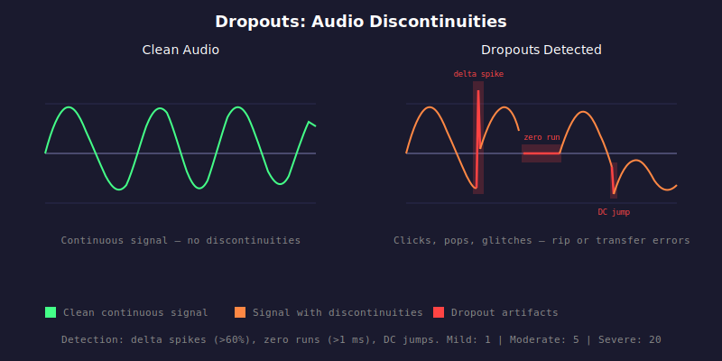

# HAU-015: dropouts

## What it does

Audible clicks, pops, and glitches. Momentary silence in the middle of audio.
Digital "hiccups" that break the flow of the music.

## What it is

Discontinuities in the audio stream: sudden amplitude jumps, runs of zero samples,
and DC level shifts. These are glitches from buffer underruns, bad disc reads,
or transmission errors.

## What caused it

> The person who ripped the media

Ripping errors, bad source, damaged files...

## Recoverability

Yes. Re-rip.

## How we detect it

Three types of discontinuity are detected:

1. **Delta spikes**: sudden amplitude jumps exceeding 60% of full scale where at least one
   side of the jump is near zero (below 1% of full scale). This distinguishes dropout
   artifacts from normal musical transients. Cross-channel correlation filters out
   intentional transients where both channels jump in the same direction with similar magnitude.

2. **Zero runs**: consecutive zero-valued samples lasting more than 1 ms in a region where the
   surrounding audio was above -50 dB RMS. This avoids flagging intentional silence.

3. **DC jumps**: sudden shifts in the windowed DC average (50 ms window) exceeding threshold.

## False positives

This is more art than science at this point.
Experimental music with aggressive transients, abrupt dynamic shifts, deliberate sonic disruptions...

... will consistently trigger this.

You need to listen to it and put context around it.

Classical music with dropouts? Definitely an issue.

John Zorn FilmWorks? Probably not.

## Severity

The total count of all discontinuity types determines severity.

Vinyl rips get higher thresholds because surface damage (scratches, debris)
can look like dropouts.

- Mild: 1 (digital), 5 (vinyl)
- Moderate: 5 (digital), 15 (vinyl)
- Severe: 20 (digital), 40 (vinyl)
