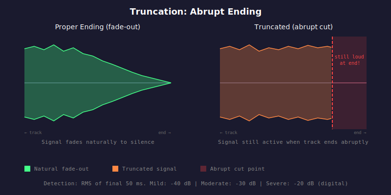

# HAU-016: truncation

## What it does

Cut off music abruptly, switching to the next track.

## What it is

The track ends abruptly instead of fading out.

## What caused it

> The record company

Unlikely, but could happen for very sloppy releases.

> The person who did the rip

Generally an incomplete rip, a damaged file, or intentionally cut audio.

## Recoverability

Find the original medium (CD or vinyl), and confirm if this is a rip issue or if the media was like that.
If the original media was like that, there is nothing to do.

## How we detect it

We seek to the final 50 ms of the track and measure the RMS level of the tail.
If the tail is still "loud" (above threshold), the track likely ends abruptly
rather than fading to silence, indicating truncation.

## False positives

Vinyl rips may have sufficient surface level noise to fool the detector.
Live music, similarly, may have high background noise.
And further, truly continuous live music over multiple tracks with no gap will definitely be flagged as "truncated", while there is nothing
wrong with that.

If you know that what you have is a live, or a vinyl, pass `--source=vinyl` or `--source=live` accordingly
to adapt the detection heuristics.

## Severity

Interpretation data for digital is as follows:
- Mild: -40
- Moderate: -30
- Severe: -20

For vinyls and live music:
- Mild: -30
- Moderate: -20
- Severe: -10

And obviously, if your source is continuous live music across tracks, you should ignore this.
