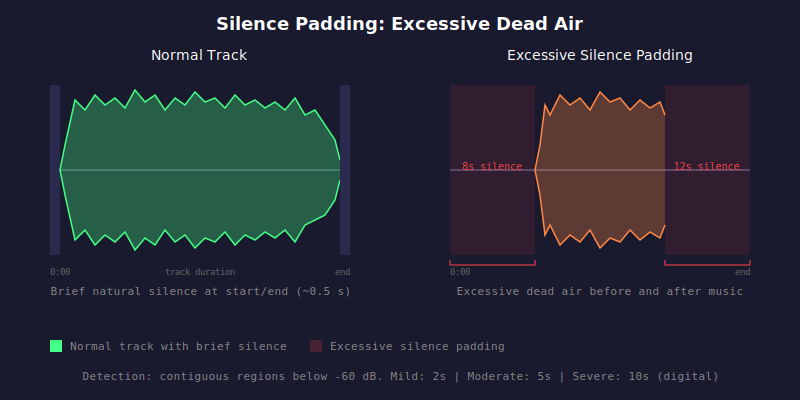

# HAU-017: silence-padding

## What it does

Ruin the vibe!

## What it is

Excessive silence at the beginning or end of a track.
Some silence is normal (pre-roll, fade-out tail).

## What caused it

> Record company

Sloppy engineering.

> The person who ripped it

If done carelessly, pre-gap can be added on CD ripping / CD burning.
Back track split with vinyl may also do that.

## Recoverability

Re-rip the media properly.
If it is still there, maybe you can edit it out...

## How we detect it

We compute windowed RMS levels (50 ms windows) across the entire track and identify
contiguous regions below -60 dB threshold. Leading silence (starting at sample 0) and
trailing silence (ending at the last sample) are reported with their duration in seconds.

## False positives

Hidden track after a very long silent end of the previous track.

## Severity

Vinyl and live sources get higher thresholds since run-in/run-out grooves
and venue ambience can look like silence.

- Mild: 2s (digital), 5s (vinyl/live)
- Moderate: 5s (digital), 10s (vinyl/live)
- Severe: 10s (digital), 20s (vinyl/live)
